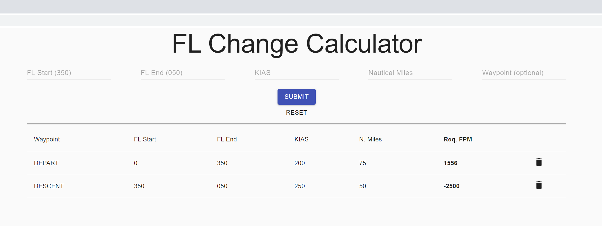

# Flight Level Change Calculator

Simple React framework to allow easy calculation of required feet-per-minute ascent/descent between two altitudes given a velocity (KIAS) and distance (NM).

This is the JavaScript version of [my Python Flask version](https://github.com/pauldewilson/FlightDescentCalculator) which does the same thing.

#### Tools used

As this was primarily a small project to practice and showcase skills learnt the following was used:
<ol>
    <li>Javascript</li>
    <li>React</li>
        <ul>
            <li>create-react-app</li>
            <li>hooks (useState, useEffect, useReducer, useContext)</li>
            <li>material-ui</li>
        </ul>
    <li>Flight Mathematics</li>
        <ul>
            <li>Custom built [calculator](src/components/calculator.js)</li>
        </ul>
</ol>

#### Sample

### How to use:

This app is hosted at [flcalc.herokuapp.com](https://flcalc.herokuapp.com/) however it is not yet optimised for mobile.

### License
Personal or educational use only, not for commercial use. Hosting not permitted.